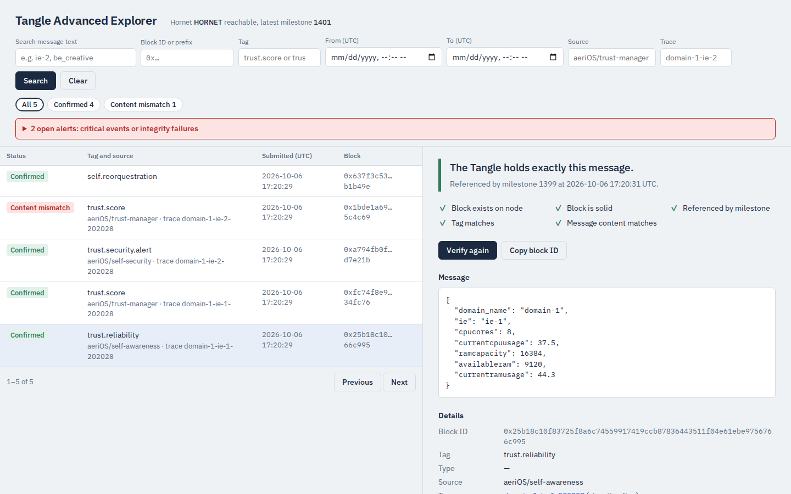
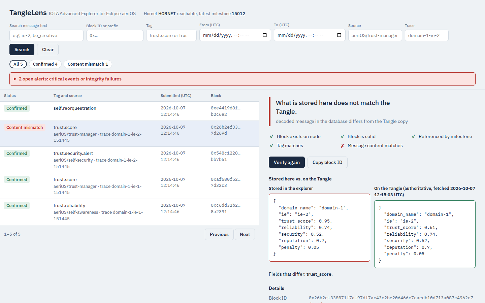
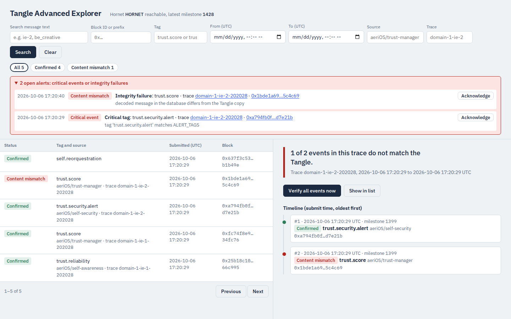

# IOTA Advanced Explorer for Eclipse aeriOS

Veles Hack 2026, Challenge 2 (O-CEI): Trust Ledger Traceability.

An observability and traceability layer on top of the aeriOS private IOTA Tangle. Every message
published through the Messages API is also stored in a searchable PostgreSQL database, enriched
with human-readable metadata, and continuously verified against the Tangle through the Hornet API.
The Tangle stays the source of truth; the explorer makes it searchable and proves its copy is faithful.

```
 aeriOS component ──► Messages API (extended) ──► Hornet ──► Tangle   (authoritative)
                        │            │                 ▲
          HTTP forward  │            │ MQTT publish    │ GET /blocks/{id}/metadata  solid? milestone? conflicting?
          (blockId +    │            ▼                 │ GET /blocks/{id}           same bytes?
           exact hex)   │      Mosquitto broker        │ GET /milestones/by-index   Tangle-attested time
                        │      aerios/iota/blocks      │
                        ▼            │ (persistent     │
                   Advanced Explorer ◄─  session)      │
                   REST API · web UI · PostgreSQL ─────┘
                   messages · validations (audit) · traces/timeline · alerts ──► UI banner, webhook,
                                                                                 MQTT aerios/explorer/alerts
```

Everything was run and tested against a **real HORNET 2.0.2 node** (the aeriOS private tangle),
not only the development mock. The evidence is in [`reports/`](reports/) (see [Evidence](#evidence)).

## Components

| Path | What it is |
|---|---|
| `messages-api/` | The aeriOS IOTA Messages API, extended. Same `POST /upload?node=` contract and HTTP 200 response as upstream. After Hornet accepts a block it forwards the blockId and the exact bytes it sent to the explorer: over HTTP (background thread, retries with backoff) and over MQTT. Neither path can fail the upload. Adds optional `type`, `source` and `trace` fields. |
| `explorer/` | FastAPI service: ingest, search, verification, traces, alerts, web UI. PostgreSQL in compose, SQLite for local runs. |
| `mosquitto/` | MQTT broker config (Eclipse Mosquitto): a second delivery path for block records and a live feed of alerts. |
| `iota-tangle/` | Vendored [eclipse-aerios/iota-tangle](https://github.com/eclipse-aerios/iota-tangle) @ `7803e5d` (Apache-2.0): Hornet 2.0 + coordinator + dashboard. |
| `mock-hornet/` | Development stand-in for Hornet, shaped after real captures. **Not part of the solution and not used in the demo.** |
| `tests/` | pytest: verification unit tests on real Hornet captures, API contract, Messages API, live smoke test. |
| `scripts/` | `demo.sh` (end-to-end demo incl. tamper detection), `capture_hornet.sh` and `measure_confirmation.py` (evidence capture). |
| `docs/` | `PITCH.md` (pitch and demo script), `DESIGN.md` (every design decision with its basis), `VERIFICATION_LOG.md`, `OPEN_QUESTIONS.md`, `DEPENDENCIES.md`, `screenshots/`, `references/` (brief, aeriOS notes, upstream originals). |

## Screenshots

| Confirmed message | Tampered copy vs. the Tangle | Trace timeline and alerts |
|---|---|---|
|  |  |  |

## Run it

Requirements: Linux (or WSL2, working inside the Linux filesystem rather than `/mnt/c`), Docker with
Compose v2, `make`, `curl`, `python3`, and `sudo` for the tangle bootstrap.

1. **Start the private tangle** (once; `bootstrap.sh` must run as root because it `chown`s the
   node's data directories to uid 65532):
   ```bash
   cd iota-tangle/docker/main
   sudo ./bootstrap.sh
   docker compose -f hornet-main.yaml up -d
   cd ../../..
   ```
   The vendored scripts already call `docker compose` (v2) instead of `docker-compose` (v1).
   Check that milestones are being issued: `curl -s localhost:14265/api/core/v2/info` shows
   `latestMilestone.index` increasing (about one every 5 s), or open the dashboard on
   http://localhost:31011 (admin/admin).
2. **Start the explorer stack** (stop the original `iota-messages-api` container first if it runs; same
   name and port 5555):
   ```bash
   make up                      # = docker compose up -d --build
   ```
   If port 8090 is taken on your machine: `EXPLORER_PORT=8091 make up` (and the same variable for `make demo`).
3. **Use it:** open http://localhost:8090, then run `make demo`.

To stop: `make down`. To wipe the tangle: `cd iota-tangle/docker/main && sudo ./cleanup.sh`.

| Command | What it does |
|---|---|
| `make up` / `make down` | Start / stop explorer, PostgreSQL, MQTT broker and Messages API (joins the tangle's `iota-net` network) |
| `make demo` | Publish aeriOS-style trust messages, show pending → confirmed, search by block id / date / tag, follow a trace timeline and its alerts, then tamper with the DB and catch it. The demo data is illustrative: aeriOS publishes no official message schema, so it uses Trust Manager vocabulary (`docs/references/aerios_trust_notes.md`) |
| `make test` | Full test suite in a container, on SQLite and on the compose PostgreSQL; summary saved in `reports/tests/` |
| `make smoke-real` | Live test: 3 messages through the Messages API to the real node must reach `confirmed` and be findable by block id, date and tag |
| `make up-mock` / `make e2e-mock` | Development only: fake Hornet on its own network (`iota-mock-net`) + stack, and the same live test against it. The tangle may keep running; only one explorer stack at a time (`make down` first) |
| `make mqtt-watch` | Print the live MQTT feed (block records and alerts) |
| `make logs`, `make reset-db` | Follow logs; wipe the explorer database (the Tangle is untouched) |

## Publishing a message

Same request as the upstream aeriOS Messages API, plus three optional fields (`type`, `source`, and
`trace`, an id that groups related events of one flow, user or sensor; 1–128 characters from `A-Z a-z 0-9 . _ : -`):

```bash
curl -s 'http://localhost:5555/upload?node=iota-hornet' -H 'Content-Type: application/json' -d '{
  "tag": "trust.score", "source": "aeriOS/trust-manager", "trace": "domain-1-ie-1",
  "message": {"domain_name": "domain-1", "ie": "ie-1", "trust_score": 0.82}}'
```

Response, HTTP 200 as upstream; Hornet's own status is in `status_code` (201 = accepted):
`{"status_code": 201, "return_payload": "{\"blockId\":\"0x…\"}", "blockId": "0x…"}`.
`type`, `source` and `trace` are explorer metadata only; the on-chain payload is unchanged
(`{"type": 5, "tag": hex(tag), "data": hex(json.dumps(message))}`), so existing consumers keep working.

## REST API

Interactive docs: http://localhost:8090/docs

| Method and path | Purpose |
|---|---|
| `POST /api/ingest` | Called by the Messages API. Idempotent on `block_id` (`created: false` on repeats). Rejects anything but a full lowercase 66-char block id (422). |
| `GET /api/messages` | Search. `block_id`: full id, or a prefix of at least 6 hex chars (`0x` optional). `tag`: exact, or `trust*` for prefix. `from`, `to`: ISO 8601, inclusive, UTC unless an offset is given. Also `type`, `source`, `trace`, `status` (comma-separated), `q` (case-insensitive text in the message or tag), `milestone`. Paging: `limit` (≤ 500), `offset`; `total` is the full count. `sort`: `-submitted_at` (default), `submitted_at`, `milestone_index`, `tag` (prefix `-` for descending). |
| `GET /api/messages/{block_id}` | Full record with verification history. |
| `GET /api/messages/{block_id}/tangle` | What the Tangle holds for this block right now (live GET block, decoded), never stored. The UI shows it next to the stored copy on a mismatch. |
| `POST /api/messages/{block_id}/verify` | Re-verify against Hornet now. |
| `GET /api/traces` | Traces (related events sharing a `trace` id): event count, first/last time, status counts, `verified` (all confirmed), `problems`. |
| `GET /api/traces/{trace_id}` | Timeline: the trace's events in chronological order, each with its verification status, milestone and milestone time. |
| `POST /api/traces/{trace_id}/verify` | Re-verify every event of the trace against its block id on Hornet now. |
| `GET /api/alerts` | Alerts, newest first, with `open` = unacknowledged count. `since_id` for polling, `unacknowledged=true`. |
| `POST /api/alerts/{id}/ack` | Acknowledge an alert (idempotent). |
| `GET /api/tags` | Tags with counts and last-seen time. |
| `GET /api/stats` | Counts per verification status. |
| `GET /api/health` | Explorer and Hornet node status. |

The three keys the brief requires: `?block_id=0x…`, `?from=2026-10-06T10:00:00Z&to=…`, `?tag=trust.score`.

## How verification works

For each stored message the explorer calls:

1. `GET /api/core/v2/blocks/{blockId}/metadata` for `isSolid`, `referencedByMilestoneIndex` and `ledgerInclusionState`.
2. `GET /api/core/v2/blocks/{blockId}` and compares the on-chain `payload.tag` and `payload.data` with what it stored, at three levels: the exact hex bytes, the decoded JSON, and a SHA-256 fingerprint. Tampering with either the raw or the human-readable copy in the database is detected.
3. `GET /api/core/v2/milestones/by-index/{index}` to record the milestone timestamp, a Tangle-attested time for the message.

| Status | UI label | Meaning | Rechecked? |
|---|---|---|---|
| `unverified` | Not checked yet | Stored, not checked yet | yes |
| `pending` | Awaiting milestone | On the Tangle and solid, not yet referenced by a milestone; content matches | yes |
| `not_solid` | Not solid yet | Node has the block but not its full past cone yet; content matches | yes |
| `confirmed` | Confirmed | Solid, milestone-referenced, not conflicting, contents identical | re-audited |
| `content_mismatch` | Content mismatch | Stored copy and Tangle differ (details say which field). Takes precedence over every other state | re-audited |
| `conflicting` | Conflicting | Ledger marks the block as conflicting | re-audited |
| `not_found` | Not on Tangle | Hornet has no such block (HTTP 404) | re-audited |
| `error` | Node error | Hornet unreachable or non-404 error; last known solidity/milestone are kept | yes |

Measured on the real node: blocks are solid within 20 ms and referenced by a milestone after
0.3–5.1 s (median 3.3 s, n = 20; milestones every ~5 s). The background loop therefore rechecks
retryable messages every 3 s (less than one milestone interval), up to 60 times. A second loop
re-audits every message every 5 minutes, so tampering after confirmation is still caught. Every
check is appended to an audit trail (`validations` table), never overwritten.

## MQTT (live feed and second delivery path)

The Messages API publishes every accepted block record to `aerios/iota/blocks`, and the explorer
publishes every alert to `aerios/explorer/alerts` (QoS 1, broker on port 1883). The explorer also
*subscribes* to `aerios/iota/blocks` with a persistent session, so records reach it on two
independent paths (HTTP and MQTT). Whichever arrives first creates the row; `received_via` records
which one did. In practice MQTT usually wins, because the publish happens inline and the HTTP
forward runs in a background thread. The HTTP forward is still sent every time, and it is the
only path when MQTT is off. If the explorer is down for longer than the HTTP retry window, the
broker keeps the records and delivers them when it comes back (tested live: `reports/mqtt/`).

Watch the live feed: `make mqtt-watch`. Set `MQTT_HOST` empty in `docker-compose.yml` to switch MQTT off.

## Alerts

Two kinds of alert are appended to the `alerts` table, shown in the UI and optionally POSTed to
`ALERT_WEBHOOK_URL`:

- **integrity**: a check moved a message *into* `content_mismatch`, `not_found` or `conflicting`. Later
  audits that find the same problem don't repeat the alert.
- **application**: a message whose tag matches `ALERT_TAGS` was ingested. Which events count as
  critical is configuration (`*.alert` in compose), not hard-coded.

## Design decisions

The full list with the basis for each is in [`docs/DESIGN.md`](docs/DESIGN.md). In short:

- **Solid is not the same as confirmed.** A block is solid almost immediately, but it is only final once a milestone references it. Reporting the two separately is what makes the status trustworthy.
- **The Messages API forwards the exact bytes it sent**, so content verification compares like with like rather than re-encoding JSON (key order or whitespace changes would cause false mismatches).
- **Enrichment metadata (`type`, `source`, `trace`, timestamps) lives only in the explorer**, so the on-chain payload format and the `/upload` contract of aeriOS are unchanged.
- **Explorer downtime never blocks or fails an upload.** The upload succeeds regardless. Records reach the explorer over two paths (HTTP with retries, MQTT with a persistent session), and ingest is idempotent, so duplicates are harmless.
- **Alerts are configuration, not invented semantics.** Integrity alerts follow the verification states; which tags count as critical is set with `ALERT_TAGS`.
- **Only full block ids go to Hornet.** Hornet zero-pads short ids instead of rejecting them, so ingest validates the format.

## Evidence

| Where | What |
|---|---|
| [`reports/hornet/README.md`](reports/hornet/README.md) | Every Hornet endpoint, field and status code we rely on, with the raw request and response saved |
| `reports/hornet/*_timing/` | Attach → milestone timing measurement |
| `reports/tests/` | pytest summaries per commit (SQLite, PostgreSQL, live smoke test) |
| `reports/demo/`, `reports/smoke/` | Demo runs and smoke test records against the real node |
| `reports/mqtt/` | Explorer outage test: records delivered over MQTT after the HTTP forward gave up |
| `reports/clean_clone/` | Fresh-clone runs of `make up`, `make test`, `make smoke-real`, `make demo` and the mock path |
| `reports/env.txt` | OS, Docker, Compose and image digests that produced the results |
| [`docs/VERIFICATION_LOG.md`](docs/VERIFICATION_LOG.md) | Every change to verification or ingest, with its evidence, failed attempts included |

## Configuration

| Variable | Service | Default |
|---|---|---|
| `EXPLORER_PORT` | compose, `demo.sh` | `8090` (host port of the explorer) |
| `EXPLORER_URL` | messages-api | `http://advanced-explorer:8090` |
| `HORNET_NODE` | messages-api | `iota-hornet` (used when `?node=` is omitted) |
| `FORWARD_RETRIES` | messages-api | `5` (backoff 0.5 s, doubling) |
| `DATABASE_URL` | explorer | `sqlite:///./explorer.db` (compose sets PostgreSQL) |
| `HORNET_URL` | explorer | `http://iota-hornet:14265` |
| `VERIFY_INTERVAL` / `AUDIT_INTERVAL` / `MAX_CHECKS` | explorer | `3` / `300` seconds / `60` |
| `ALERT_TAGS` | explorer | compose: `*.alert` (comma list of shell-style globs; a matching tag raises an application alert; empty = off) |
| `ALERT_WEBHOOK_URL` | explorer | empty (if set, every alert is POSTed there as JSON, best effort) |
| `MQTT_HOST` / `MQTT_PORT` | explorer, messages-api | compose: `mqtt-broker` / `1883` (empty host = MQTT off) |
| `MQTT_BLOCKS_TOPIC` / `MQTT_ALERTS_TOPIC` | both / explorer | `aerios/iota/blocks` / `aerios/explorer/alerts` |

## Limitations

- **No authentication** on the explorer or the Messages API. Fine for a local demo, not for production.
- **Delivery to the explorer is not fully durable.** HTTP forwarding retries for ~15 s. MQTT covers longer explorer outages through the broker's persistent session, but a message is lost if the broker is *also* unreachable when it is published. If the explorer cannot store a record (e.g. its database is down), MQTT keeps retrying for ~45 s and otherwise leaves it unacknowledged for redelivery on reconnect (tested live: `reports/mqtt/`). There is no backfill from the Tangle yet; ingest is idempotent, so one can be added safely.
- **MQTT broker runs with demo settings**: anonymous access, no TLS.
- **Public default keys.** The tangle's coordinator and dashboard keys are the upstream defaults published in the repo. Change them for anything beyond a local demo (see `iota-tangle/README.md`).
- **Single node.** On this one-node tangle Hornet reports `isHealthy: false` (and `/health` 503) although milestones flow normally; the explorer shows the node as reachable and does not depend on that flag. `conflicting` and `not_solid` were never observed on the real node; they are covered by tests derived from real responses.
- The Messages API runs on Flask's development server, as upstream does.

## Licence and attribution

Apache-2.0 (see [`LICENSE`](LICENSE)). Includes modified code from the Eclipse aeriOS project
(`eclipse-aerios/iota-tangle`, `eclipse-aerios/iota-messages-api`, both Apache-2.0); see [`NOTICE`](NOTICE)
for what was changed. The unmodified upstream Messages API is kept in `docs/references/upstream/` for comparison.
